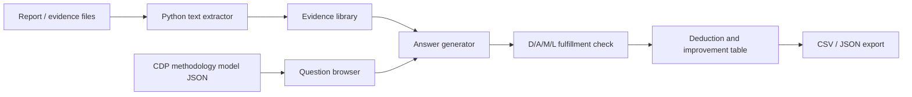

# CDP Writer Integrated Homepage - Design

## Context Anchor

| Item | Anchor |
| --- | --- |
| WHY | CDP 평가 서비스의 핵심은 빠른 작성보다 평가방법론과 실제 등급 산정의 일치성이다. |
| WHO | ESG/CDP 컨설턴트가 비개발자 환경에서 사용한다. |
| RISK | 자동 작성 결과를 공식 점수로 오인하거나, 증빙이 없는 내용을 답변에 넣으면 리스크가 생긴다. |
| SUCCESS | 문항별 최대득점 경로와 부족 요소가 한눈에 보이고, 증빙 기반 초안이 글자수에 맞게 생성된다. |
| SCOPE | 2025 CC CH 데이터 기반 MVP로 시작하되, 2026 기준과 다른 산업 데이터로 교체 가능한 구조를 둔다. |

## 1. Recommended Architecture

| Option | Description | Decision |
| --- | --- | --- |
| Minimal Static | HTML/CSS/JS만 사용한다. 파일 추출은 제한적이다. | Office 파일 처리 요구 때문에 부족하다. |
| Heavy Fullstack | React, DB, API, 계정 기능까지 포함한다. | 현 단계에서는 유지보수 부담이 크다. |
| Pragmatic Local App | 정적 UI와 표준 라이브러리 중심 Python 서버를 결합한다. | 채택. 비개발자 실행성과 파일 처리의 균형이 좋다. |

## 2. Data Flow

## 3. Main Screens

- Dashboard: 데이터셋, 문항 수, 산업 특수 문항, 작성 진행률, 감점 후보 요약
- Writer: 문항 선택, 최대득점 경로, 증빙 입력, 답변 생성, 충족 판단
- Evaluation: 감점/부분충족 기준만 모아 보고 개선 문장 확인
- Evidence: DOCX/PPTX/XLSX/TXT/CSV/JSON 업로드 및 추출 텍스트 관리
- Export: 답변 초안, 충족 상태, 감점 요소를 CSV/JSON으로 내보내기

## 4. Scoring Logic

- 공식 평가방법론의 문항별 `fullScoreChecklist`를 D/A/M/L 섹션으로 분리한다.
- 각 섹션의 기준 문구에서 필요한 신호를 추출한다.
- 사용자가 붙여넣은 증빙, 키워드, 생성 초안에서 신호 존재 여부를 확인한다.
- 판정은 `충족 가능`, `부분 보완 필요`, `보완 필요` 세 단계로 표시한다.
- 공식 점수 확정이 아니라 사전검토 QA로 명시한다.

## 5. File Extraction

- DOCX: `word/*.xml`에서 문단과 표 텍스트 추출
- PPTX: `ppt/slides/*.xml`, `ppt/notesSlides/*.xml`에서 슬라이드/노트 텍스트 추출
- XLSX: `openpyxl` 사용 가능 시 시트별 셀값 추출, 없으면 ZIP XML fallback
- TXT/CSV/JSON: 인코딩 감지 후 텍스트로 추출
- PDF: `pypdf`가 있으면 추출, 없으면 수동 붙여넣기 안내

## 6. Implementation Guide

- `server.py`: 정적 파일 제공 및 `/api/extract` 업로드 추출 API
- `index.html`: 단일 페이지 앱 구조
- `styles.css`: CDP 포털형 업무 UI
- `app.js`: 데이터 로드, 문항 탐색, 초안 생성, 충족 판단, 내보내기
- `data/cdp_cc_ch_model_answers.json`: 2025 CC CH 모범답안 데이터
